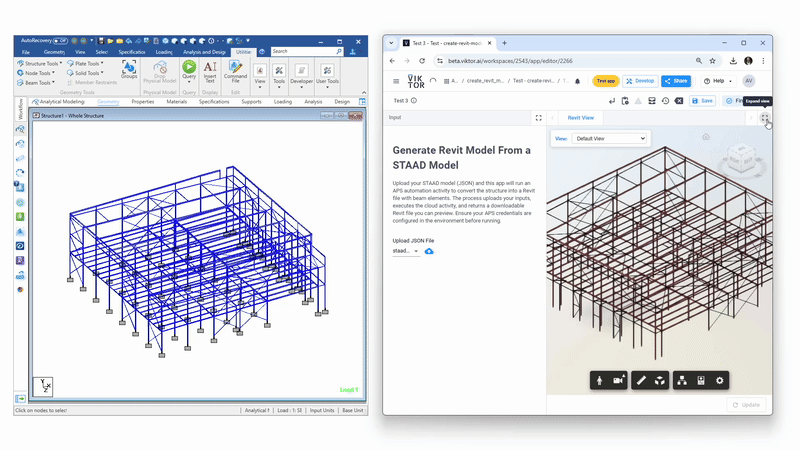

# STAAD | VIKTOR | Autodesk Platform Services Integration

Push active STAAD connectivity into a VIKTOR application and trigger Autodesk Revit automation via APS Design Automation API.

This application allows you to create steel elements in Revit directly from STAAD.Pro models using the Autodesk Platform Services (APS) Design Automation API. Supported UK steel sections: Universal Beams (UB), Universal Columns (UC), and Equal Angles (EA).



## Prerequisites

- Python 3.13+
- [uv](https://docs.astral.sh/uv/) package manager
- STAAD.Pro installed locally
- Autodesk Platform Services credentials
- Viktor account
- **Revit 2024** (Design Automation engine targets this version)

## Important Notes

- The automation targets **Revit 2024** only
- Both `autodesk-automation/files/revit_input.rvt` and `viktor-app/files/revit_input.rvt` are Revit template files pre-loaded with UK standard steel library types (UB, UC, EA sections)
- Only UK steel sections are supported: Universal Beams, Universal Columns, and Equal Angles

---

## Installation

Install uv if not already installed:

```bash
# Windows (PowerShell)
powershell -ExecutionPolicy ByPass -c "irm https://astral.sh/uv/install.ps1 | iex"
```

Clone the repository and sync dependencies:

```bash
git clone https://github.com/AlejoDuarte23/staad-viktor-autodesk-integration.git
cd staad-viktor-autodesk-integration
uv sync
```

For development dependencies (includes PyInstaller):

```bash
uv sync --group dev
```

---

## Setup

### 1. APS Credentials

Get your Autodesk Platform Services credentials at: https://aps.autodesk.com/

Create a `.env` file in the project root:

```bash
cp sample.env .env
```

Edit `.env` with your credentials:

```
CLIENT_ID=your_client_id_here
CLIENT_SECRET=your_client_secret_here
```

Also create/update the `.env` file in `viktor-app/` using `viktor-app/.env.sample` as reference. This file requires both APS credentials and activity signatures generated in step 2.

### 2. Create the Automation Activity

Open and run the Jupyter notebook:

```
autodesk-automation/example_create_structural_elements.ipynb
```

This notebook registers the Design Automation bundle and activity with APS. By default, the notebook deletes the activity and bundle at the end for testing purposes. For production use, run only up to the activity creation step (do not run the cleanup cells).

**Supported sections:** UK Universal Beams (UB), Universal Columns (UC), and Angles only.

After running the notebook, copy the generated activity signatures to your `viktor-app/.env` file.

### 3. Viktor Account Setup

Create a free Viktor account: https://docs.viktor.ai/docs/getting-started/installation/

#### Local Development

Run the Viktor app locally:

```bash
cd viktor-app
viktor-cli start
```

#### Publishing the App

To use the APS integration in production, you must publish the Viktor app:

1. Follow the publishing guide: https://docs.viktor.ai/docs/publish-apps/
2. Add environment variables in the app details page: https://docs.viktor.ai/docs/create-apps/development-tools-and-tips/environment-variables/

Required environment variables:
- `CLIENT_ID`
- `CLIENT_SECRET`
- Activity signatures from your `.env` file

### 4. Build the Windows Executable

Build the STAAD-Viktor connector executable:

```bash
uv run --group dev pyinstaller --clean staad_viktor.spec
```

The bundled application is output to `dist/staad_viktor/`.

### 5. Configure STAAD User Tool

1. Open STAAD.Pro
2. Go to **Utilities → User Tools → Configure**
3. Add a new tool:
   - Name: `VIKTOR Push`
   - Path: `<project_path>\dist\staad_viktor\staad_viktor.exe`
4. Run from **User Tools** menu

### 6. Generate Viktor API Token

To connect your local STAAD with the published Viktor application, generate a personal access token:

1. Log in to your Viktor environment (`{company}.viktor.ai` or `cloud.viktor.ai`)
2. Click the three dots next to your name (top right corner)
3. Click **Settings**
4. Select the **Access Tokens** tab
5. Click **Generate new personal access token**
6. Copy and store the token securely (format: `vktrpat_●●●●●●●●●●●●●●_●●●●●●●●●●●●●●●●●●●●●●●●●●`)

Reference: https://docs.viktor.ai/docs/api/

---

## Usage

1. Open your STAAD model
2. Run the STAAD-Viktor tool from **User Tools**
3. Enter:
   - Viktor editor URL (e.g., `https://cloud.viktor.ai/workspaces/2539/app/editor/2262`)
   - Personal access token
4. Click **Push STAAD data**

The structural geometry is sent as JSON to the file field in your Viktor application. From there you can:
- Update the Revit view
- Trigger the APS Design Automation to generate Revit elements

---

## Development

### Running the PyQt Front-end Directly

```bash
uv run python -m frontend.qt_app
```

### Project Structure

```
├── autodesk-automation/    # APS Design Automation setup notebook
├── backend/                # STAAD COM interface and Viktor API
├── frontend/               # PyQt desktop application
├── viktor-app/             # Viktor web application
├── pyproject.toml          # Project dependencies
└── staad_viktor.spec       # PyInstaller configuration
```

---

## Demo & Support

Interested in exploring more possibilities with the Autodesk ecosystem integration? Book a demo with the Viktor team: https://www.viktor.ai/book-a-demo

Mention Revit automation and APS Design Automation in your request.
